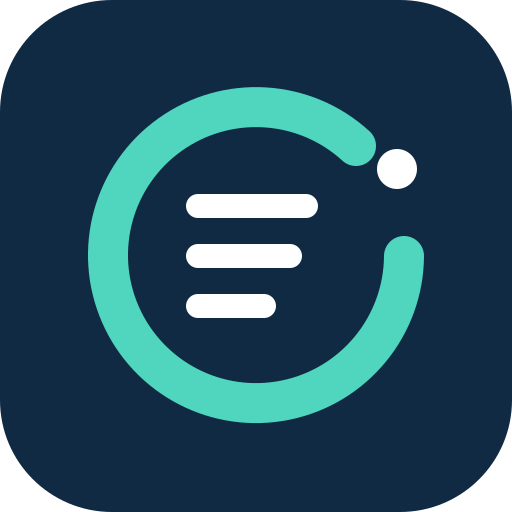

# obligacje.io

Research active Polish corporate GPW RR bonds with obligacje.io in a connected
application. This package contains a workflow skill, a remote MCP connection
manifest, documentation and branding assets. Version **0.1.3** updates the
support contact to obligacje-io@agentmail.to and retains the proposed review
cases, explicit knowledge locale and direct article link instructions.
Production protocol checks with an ordinary account passed
on 2026-10-04. Hosted acceptance, execution of the proposed review cases, the demo
recording, provider review and directory publication remain pending; this
package does not establish that a listing is available.

## What you can ask

- Search, filter and compare the active corporate bond catalog on the GPW
  regulated market (GPW RR), and inspect issuers and selected series.
- Read available cached document summaries, typed facts and topic context with
  source documents, page citations, provenance and explicit evidence gaps.
- Read the curated Polish/English knowledge articles. Treasury bond coverage is
  educational knowledge, not a Treasury instrument catalog.
- Ask one focused question through the obligacje.io assistant and follow
  validated links back to the website.

The 12 catalog, document, knowledge and navigation tools are read-only.
`ask_assistant` creates a private conversation in the connected obligacje.io
account and consumes its existing assistant allowance. It is not read-only or
idempotent. Send only the question and necessary context; do not send the whole
external chat or automatically retry a timed-out assistant request.

Results are information and education, **not investment advice**. Assistant
answers may contain errors. Check cited original sources. Missing evidence is
not proof that a clause does not exist. Contract documents do not establish
current covenant compliance, completed payments, actual creation of security,
current fixings or the issuer's present financial condition. The integration
does not provide live prices, investment recommendations, trading or brokerage.

## Connection and access

The target endpoint is
[https://api.obligacje.io/mcp](https://api.obligacje.io/mcp), using Streamable HTTP.
Connection uses the user's obligacje.io account, browser sign-in and explicit
OAuth consent, subject to existing usage limits. Catalog reads and assistant
turns have separate scopes. Users
can revoke a connection in their obligacje.io account controls. Never paste
passwords, API keys, session cookies or access tokens into a chat or this package.

The launch targets hosted OAuth flows in ChatGPT and claude.ai. Ordinary-account
hosted acceptance remains pending. Claude Cowork has not been verified. Claude Code
and local Codex flows requiring loopback OAuth callbacks are unsupported by this
launch; inclusion of a portable manifest does not establish support for them.

Read the setup guide in [Polish](https://www.obligacje.io/integracje) or
[English](https://www.obligacje.io/en/integrations). Follow the application's
connection flow when the integration becomes available, then review the consent
screen before granting access. Directory availability and account permissions
can depend on the host application.

For support, use the [support section](https://www.obligacje.io/en/integrations#support)
or email [obligacje-io@agentmail.to](mailto:obligacje-io@agentmail.to). Read the
[privacy policy](https://www.obligacje.io/en/privacy-policy) and
[terms of service](https://www.obligacje.io/en/terms). The connected application
also processes received information under its own terms and account settings.

## Package and review status

The [workflow skill](./skills/obligacje/SKILL.md) describes tool selection and
evidence handling. The [review cases](./review-cases.json) contain exactly five
positive and three negative **proposed cases**, all pending execution. They
describe expected outcomes, not observed results. The
[recording script](./recording-script.md) is also unexecuted; no demo recording
URL or reviewer credentials are bundled. Passed production protocol checks
remain separate from hosted acceptance, the demo and provider review/publication.

The [changelog](./CHANGELOG.md) records package revisions. The [MIT license](./LICENSE)
covers only the distributed package files. It does not license the backend,
hosted API service, bond data or third-party source documents. The application
repository remains private; distributing this package does not expose its source.

## Packaging references

These public references explain the package formats and review requirements:

- [OpenAI plugin packaging](https://developers.openai.com/plugins/build/plugins)
  and [submission](https://developers.openai.com/plugins/deploy/submission).
- [Claude plugin structure](https://claude.com/docs/plugins/build),
  [pre-submission checklist](https://claude.com/docs/plugins/pre-submission-checklist),
  [platform support](https://claude.com/docs/plugins/platform-support) and
  [manifest reference](https://code.claude.com/docs/en/plugins/manifest-reference).
